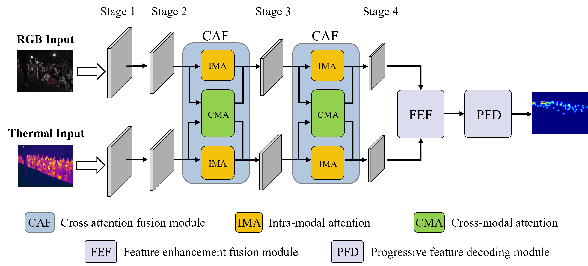

# HAFNet: Hierarchical Attention Fusion Network for RGB-T Crowd Counting

## Introduction

Crowd counting plays an important role in intelligent surveillance, public safety, and urban management. RGB-based crowd counting methods often suffer from illumination variations and background interference, while thermal imagery provides complementary information under challenging lighting conditions.

To address these challenges, we propose **HAFNet**, a Hierarchical Attention Fusion Network for RGB-T crowd counting. HAFNet employs a dual-stream Swin Transformer backbone to extract modality-specific representations and introduces hierarchical attention fusion mechanisms to effectively exploit complementary information between RGB and thermal modalities.

---

## Framework



---

## Environment

### Requirements

```bash
Python >= 3.9
PyTorch >= 2.0
CUDA >= 11.8
torchvision
numpy
opencv-python
scipy
tqdm
matplotlib
```

---

## Dataset Preparation

### RGBT-CC Dataset

### DroneRGBT Dataset

---

## Code, Data, and Materials Availability

The source code, trained models, and implementation details are publicly available in this repository.

The datasets used in this work can be obtained from their respective official sources.

---

## Contact

**Yanfang Jiu**

Email: jiuyanfang@163.com
